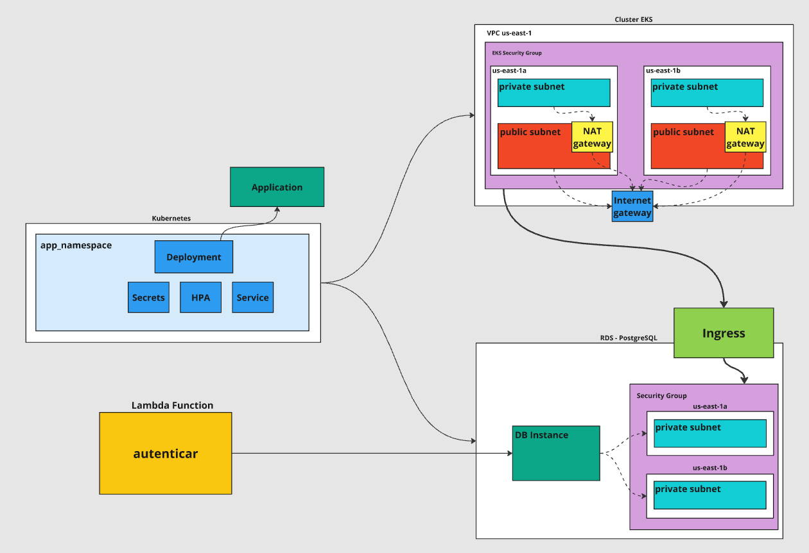

# autoatendimento-kubernetes
### Para rodar a aplicação é necessário alguns passos:
1 - Criação do bucket para guardar o terraform state
```ts
backend "s3" {
    bucket = "autoatendimento-bucket"
    key    = "dev/application/terraform.tfstate"
    region = "us-east-1"
  }
```
2 - Preenchimento dos inputs descritos nesta documentação

3 - Executar o script: 
```bash
$ terraform apply --auto-approve
```
## INFRAESTRUTURA

<!-- BEGIN_TF_DOCS -->
## Requirements

| Name | Version |
|------|---------|
| <a name="requirement_aws"></a> [aws](#requirement\_aws) | 4.48.0 |
| <a name="requirement_kubernetes"></a> [kubernetes](#requirement\_kubernetes) | 2.17.0 |

## Providers

No providers.

## Modules

| Name | Source | Version |
|------|--------|---------|
| <a name="module_database"></a> [database](#module\_database) | git@github.com:arthurgabriel73/autoatendimento-database.git | main |
| <a name="module_eks"></a> [eks](#module\_eks) | git@github.com:arthurgabriel73/autoatendimento-infra.git | main |
| <a name="module_kubernetes"></a> [kubernetes](#module\_kubernetes) | ./modules/kubernetes | n/a |

## Resources

No resources.

## Inputs

| Name | Description | Type | Default | Required |
|------|-------------|------|---------|:--------:|
| <a name="input_app_name"></a> [app\_name](#input\_app\_name) | Name of the application | `string` | n/a | yes |
| <a name="input_cidr_block"></a> [cidr\_block](#input\_cidr\_block) | Networking CIDR block to be used for the VPC | `string` | n/a | yes |
| <a name="input_datasource_url"></a> [datasource\_url](#input\_datasource\_url) | Datasource URL | `string` | n/a | yes |
| <a name="input_db_name"></a> [db\_name](#input\_db\_name) | Name of the database | `string` | n/a | yes |
| <a name="input_db_password"></a> [db\_password](#input\_db\_password) | Password for the database | `string` | n/a | yes |
| <a name="input_db_username"></a> [db\_username](#input\_db\_username) | Username for the database | `string` | n/a | yes |
| <a name="input_email_from"></a> [email\_from](#input\_email\_from) | Email from | `string` | n/a | yes |
| <a name="input_image_name"></a> [image\_name](#input\_image\_name) | Name of the container image | `string` | n/a | yes |
| <a name="input_image_username"></a> [image\_username](#input\_image\_username) | Username for the container image | `string` | n/a | yes |
| <a name="input_image_version"></a> [image\_version](#input\_image\_version) | Version of the container image | `string` | n/a | yes |
| <a name="input_jwt_secret_key"></a> [jwt\_secret\_key](#input\_jwt\_secret\_key) | JWT secret key | `string` | n/a | yes |
| <a name="input_mail_host"></a> [mail\_host](#input\_mail\_host) | Mail host | `string` | n/a | yes |
| <a name="input_mail_password"></a> [mail\_password](#input\_mail\_password) | Password for the email | `string` | n/a | yes |
| <a name="input_mail_port"></a> [mail\_port](#input\_mail\_port) | Mail port | `string` | n/a | yes |
| <a name="input_mail_username"></a> [mail\_username](#input\_mail\_username) | Username for the email | `string` | n/a | yes |
| <a name="input_mercado_pago_access_token"></a> [mercado\_pago\_access\_token](#input\_mercado\_pago\_access\_token) | Mercado Pago access token | `string` | n/a | yes |
| <a name="input_mercado_pago_caixa_id_externo"></a> [mercado\_pago\_caixa\_id\_externo](#input\_mercado\_pago\_caixa\_id\_externo) | Mercado Pago caixa ID externo | `string` | n/a | yes |
| <a name="input_mercado_pago_caixa_url"></a> [mercado\_pago\_caixa\_url](#input\_mercado\_pago\_caixa\_url) | Mercado Pago caixa URL | `string` | n/a | yes |
| <a name="input_mercado_pago_loja_id_externo"></a> [mercado\_pago\_loja\_id\_externo](#input\_mercado\_pago\_loja\_id\_externo) | Mercado Pago loja ID externo | `string` | n/a | yes |
| <a name="input_mercado_pago_loja_url"></a> [mercado\_pago\_loja\_url](#input\_mercado\_pago\_loja\_url) | Mercado Pago loja URL | `string` | n/a | yes |
| <a name="input_mercado_pago_pedido_url"></a> [mercado\_pago\_pedido\_url](#input\_mercado\_pago\_pedido\_url) | Mercado Pago pedido URL | `string` | n/a | yes |
| <a name="input_mercado_pago_qr_code_url"></a> [mercado\_pago\_qr\_code\_url](#input\_mercado\_pago\_qr\_code\_url) | Mercado Pago QR code URL | `string` | n/a | yes |
| <a name="input_mercado_pago_vendedor_id"></a> [mercado\_pago\_vendedor\_id](#input\_mercado\_pago\_vendedor\_id) | Mercado Pago vendedor ID | `string` | n/a | yes |
| <a name="input_notification_url"></a> [notification\_url](#input\_notification\_url) | URL for notifications | `string` | n/a | yes |
| <a name="input_project_name"></a> [project\_name](#input\_project\_name) | Project name to be used to name the resources (Name tag) | `string` | n/a | yes |
| <a name="input_region"></a> [region](#input\_region) | AWS region to create the resources | `string` | n/a | yes |
| <a name="input_tags"></a> [tags](#input\_tags) | A map of tags to add to all AWS resources | `map(any)` | n/a | yes |

## Outputs

| Name | Description |
|------|-------------|
| <a name="output_app_service_load_balancer_ip"></a> [app\_service\_load\_balancer\_ip](#output\_app\_service\_load\_balancer\_ip) | The host of the service |
| <a name="output_app_service_port"></a> [app\_service\_port](#output\_app\_service\_port) | The port of the service |
| <a name="output_database_endpoint"></a> [database\_endpoint](#output\_database\_endpoint) | The endpoint of the database |
<!-- END_TF_DOCS -->